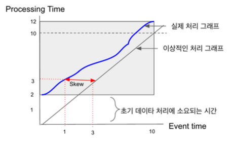

# 데이터 처리

### 1. 데이터의 종류: Bounded data & Unbounded data
**1.1 Bounded data**
데이터가 저장된 후 더 이상 양이 증가하거나 변경이 없는 형태로 계속 유지되는 데이타를 뜻한다. 예를 들어, 10월의 식당 매출 데이터, 2018년 신규 회원 목록 등이 있다.

**1.2 Unbounded data**
데이터의 수가 정해져있지 않고 계속해서 추가되는, 즉, 끊임없이 흘러 들어오는 데이터라고 볼 수 있다. 예를 들어, 모바일 디바이스에서 계속 올라오는 로그, 페이스북이나 트위터의 피드, 증권거래 주문처럼 계속해서 들어와서 쌓이는 데이터를 Unbounded data라고 한다.

### 2. 용어 정리: Event time & Processing time
데이터의 발생 시간과 시스템에서 처리되는 시간에는 차이가 발생하는데, 이를 각각 Event time과 Processing time이라고 정의한다.

예를 들어, 게임에서 사용자가 공격을 한 이벤트를 서버에 전달해서 처리하여 저장하는 시나리오가 있다고 가정하자. 공격 이벤트가 1:00:00에 발생하였고, 이 데이터가 네트워크를 타고 서버로 도달하여 프로그램 로직을 수행하고 저장하는데 2초가 소요되었다면, Event time은 1:00:00가 되고, Processing time은 1:00:02가 된다.

이상적으로 Event time과 Processing time이 동일하면 좋겠지만, 네트워크 시간이나 처리 시간에 따라 Processing time이 Event time 보다 늦고, 또한 Processing time에서 소요되는 실제 처리 시간은 일정하지 않고 아래 그림의 파란색 그래프(실제 처리 그래프)처럼 들쭉날쭉하다. 네트워크/서버의 시스템 자원 상황이 항상 차이가 나기 때문이다.

위 그림을 통해서 개념을 다시 정리해보면, x축은 Event time, y축은 Processing Time이다. 0초에 발생한 데이터가 서버까지 도착하기 위한 시간이 소요되기 때문에, 아래 그림과 같이 Processing Time은 2초부터 시작한다. Skew는 Event time과 Processing time 사이의 간격, 즉, 딜레이다.

### 3. Bounded data 처리
Bounded data는 이미 저장되어 있는 데이터를 처리하는 것이기 때문에 별다른 고도의 처리 패턴 필요없이 데이터를 읽어서 한 번에 처리하고 저장하면 된다.

### 4. Unbounded data 처리
Unbounded data는 크게 Batch와 Streaming 두 가지 방식으로 처리할 수 있다.

**4.1 Batch 처리 방식**
**4.1.1 Fixed Windows**
Fixed Windows 방식은 스트리밍으로 들어오는 데이터를 일정 시간 단위로 모은 후, Batch로 처리 하는 방식이다. 예를 들어 아래 그림과 같이 10에서 시작하여 11시까지 1시간 동안 데이터를 수집한 후, 11시 이후에, 10 ~ 11시에 들어온 데이터를 한 번에 처리 및 정리하는 방식이다.

이 방식은 구현이 간단하다는 장점이 있지만, 일정량의 데이터가 모두 수집된 후 처리를 시작하기 때문에, 실시간성이 다소 떨어진다.

4.1.2?

**4.2 Streaming 처리 방식**
Unbounded data를 제대로 처리하려면 Streaming 처리를 하는 것이 효율적이다. Steaming 처리 방법에는 Time agnostic, Filtering, Inner join, Windowing 등이 있다.

Streaming 처리는 Batch 처리에 비해서 복잡하다. Unbounded data는 기본적으로 Skew가 환경에 따라 변화가 심하기 때문에, 데이터가 시스템에 도착하는 순서 역시 순차적으로 도착하지 않고 뒤죽박죽이다.

**4.2.1 Time agnostic**
Time agnostic이란, 데이터가 시간 속성을 가지고 있지 않는 경우를 의미한다. 들어오는 대로 즉각적으로 처리를 하면 되기 때문에 별다른 노하우가 필요 없다.

**4.2.2 Filtering**
들어오는 데이터 중 특정 데이터만 필터링해서 저장하는 구조이다.

예를 들면, 웹에서 로그 데이터를 수집할 때, 특정 IP나 국가 대역에서 들어오는 데이터만 필터링해서 저장하는 경우이다.

**4.2.3 Inner join**
Inner join은 두 개 이상의 Unbounded data로 들어오는 값을 서로 비교하여 매칭해서 처리하는 방식이다.

모바일 뉴스 앱과 지도 앱의 예를 살펴보자. 뉴스 앱에서는 사용자가 어떤 컨텐츠를 보는지에 대한 데이터를 수집/전송하고, 지도 앱에서는 현재 사용자의 위치를 수집/전송한다고 하자.

이 경우, 사용자별 뉴스 뷰에 대한 Unbounded data와, 사용자별 위치에 대한 Unbounded data가 있는데, 이 두 개의 데이터 스트림을 사용자로 Inner join하면 사용자가 어떤 위치에서 어떤 뉴스를 보는지에 대해 분석을 할 수 있게 된다. 

Inner join을 구현하기 위해서는 데이터 동기화 문제를 해결해야 한다. 양쪽 스트림의 데이터가 항상 같은 시간에 도착하는 것은 아니기 때문에, 반대쪽 데이터가 도착할 때까지 기다리는 동안 먼저 도착한 데이타를 임시로 저장할 버퍼 영역이 필요하고, 이 영역에 임시로 일정 기간 데이타를 저장하고 있다가 반대쪽 스트림에서 데이터가 도착하면 이를 Inner join해서 결과를 저장하고, 버퍼 영역에서 양쪽의 데이터를 삭제한다.

만약에 반대쪽의 데이터가 도착하지 않으면, 버퍼 영역에 데이터가 계속해서 쌓이기 때문에, 일정 시간이 지나면 반대쪽 스트림에서 데이터가 도착하지 않은 데이터를 주기적으로 삭제 해주는 Garbage Collector가 필요하다.

**4.2.4 Approximation algorithms(근사치 추정 방식)**
근사치 추정 방식은 실시간 데이타 분석에서 많이 사용된다. 실시간 분석에서는 전체 데이터를 모두 분석할 수 있는 시간이 없는 경우가 종종 발생하고, 시급한 분석이 필요한 경우가 있기 때문에, 전체 데이터가 아니라 일부만 분석하거나, 또는 대략적인 데이터의 근사값만을 구하는 방법으로 빠르게 데이타를 분석하는 경우가 있다. 이를 근사치 추정 방식이라고 한다.

예를 들면, VOD 서비스에서 최근 10분간 인기있는 비디오 목록, 최근 12시간 동안 가장 인기 있는 판매 제품 목록 등을 분석하는 경우이다. 이런 경우 데이터는 아주 정확하지 않아도 근사치만 있으면 되고, 최신의 데이터를 실시간으로 보는 시급성이 중요하다. 전체 데이터를 모두 보고 분석하는 것이 어렵고 불필요하기 때문에, 샘플링을 하거나 대략적인 근사치만을 구해서 결과를 낸다.

이런 근사치를 추정하는 알고리즘에는 K-means나 Approximate Top-N 등 이미 알려진 있는 것들이 많다.

**4.2.5 Windowing**
실시간 스트리밍 데이터 처리에서 중요한 개념 중의 하나이다. Windowing은 스트리밍 데이터를 일정 시간 간격(Window)으로 나누어 처리하는 방식이다. 나누는 방법에 따라 다양한 Windowing 방식이 존재한다.

**4.2.5.1 Fixed Windows**
4.1.1에서 언급한 방식과 동일하다. 정확하게 일정 시간 단위로 Window를 나누는 개념이다. Window 사이즈가 10분 일 때, 1시 10분에는 1시 00분 ~ 1시 10분의 데이타를, 1시 20분에는 1시 10분 ~ 1시20분의 데이터를 처리하는 식이다.

**4.2.5.2 Sliding Windows**
Sliding Window 방식은 Window를 움직이는 개념이다. 현재 시간으로 부터 N시간 전후의 데이터를 매 M시간마다 추출하는 방식이다. 이 과정에서 Window들은 시간 상 서로 겹치게 된다.

예를 들어, 현재시간으로부터 10분 전(N = 10)에서 측정시간까지의 접속자를 1분(M = 1) 단위로 측정하는 경우를 생각할 수 있다. 매 1분 간격으로 데이터를 추출하는데, 매번 그 시간으로부터 10분전의 데이타를 추출하기 때문에 9분간의 데이터가 중첩된다.

이렇게 추출하는 간격을 Period(M), 그리고 추출하는 기간을 Length 또는 Size(N)라고 한다.

**4.2.5.3 Session Windows**
Session Windows 방식은 사용자가 서비스를 사용하다가 일정 시간동안 반응이 없는 경우(데이터가 갱신되지 않는 경우)에, 세션 시작에서 부터 반응이 없어진 시간까지를 한 Window로 묶어서 처리한다.

예를 들어, 세션의 Timeout이 20분이라고 가정하자. 세션이 11시에 시작된 뒤에 11:01, 11:15, 11:40에 데이터가 갱신되었다면, 11:15 이후에 20분동안(1:35까지) 데이터가 갱신되지 않았기 때문에, 11:00, 11:01, 11:15은 하나의 Window로 처리되고, 1:40은 새로운 세션 시작으로 여겨지게 된다.

**4.2.5.4 Processing time based windowing**
Processing time을 기준으로 Windowing을 하여 데이터를 처리하는 방식이다. 이는 크게 어렵지 않다. 데이타가 도착한 순서대로 처리해서 저장하면 된다.

**4.2.5.5 Event time based windowing**
Event time을 기준으로 데이터를 처리하는 방식이다. 데이터가 순서대로 들어오지 않는 경우가 대다수이고, 또한 데이타의 도착 시간또한 일정하지 않기 때문에 어려운 문제이다.

좌측 흰색 화살표 처럼 12:00 ~ 13:00에 서버에 도착한 데이터가 실제로는 11:00 ~ 12:00에 발생한 데이터일 경우, 11:00 ~ 12:00의 Window에 데이터를 반영해주어야 한다.

이러한 Event time 기반의 스트리밍 처리는 아래와 같이 기술적으로 두 가지 주요 고려사항이 있다.

> (1) Buffering
> 늦게 도착한 데이타를 처리해야 하기 때문에 Window를 일정 시간동안 유지해야 한다. 이를 위해 메모리나 별도의 디스크 공간을 사용한다.
> (2) Completeness
> Buffering을 적용한다면, 얼마 동안 버퍼를 유지해야 할까? 즉, 해당 시간에 발생한 모든 데이터는 언제 모두 도착이 완료(Completeness) 되는지를 결정해야 하는 것이다. 정확한 완료 시점을 예상하는 것은 현실적으로 어렵다. 버퍼를 아주 크게 잡으면 거의 모든 데이타를 잡아낼 수 있겠지만, 버퍼를 아주 크게 잡는 것이 어렵기 때문에, 데이터가 도착 예상 시점을 어림 잡아 짐작할 수 있는 방법을 사용해야 한다. 예를 들어, 워터마크 기법 등이 있다.

### References
http://bcho.tistory.com/1119
https://www.oreilly.com/ideas/the-world-beyond-batch-streaming-101
https://cloud.google.com/dataflow/model/windowing#sliding-time-windows
https://cloud.google.com/dataflow/model/windowing#session-windows

### Further reading
[Storm을 이용한 근사치 구하기](https://pkghosh.wordpress.com/2014/09/10/realtime-trending-analysis-with-approximate-algorithms/)
[Apache Spark에서 K-means로 근사치 구하기](https://databricks.com/blog/2015/01/28/introducing-streaming-k-means-in-spark-1-2.html)
